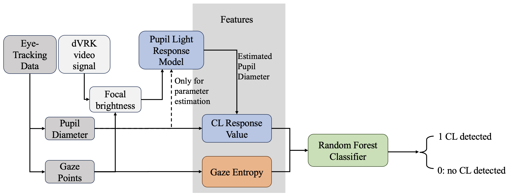

<div align="center">

#  Cognitive effort detection for tele-robotic surgery via personalized pupil response modeling



</div>
<div align="left">

## Summary

Code for our paper, [Cognitive effort detection for tele-robotic surgery via personalized pupil response modeling](https://link.springer.com/article/10.1007/s11548-024-03108-z), which was presented at IPCAI 2024 in Barcelona, Spain.

Gaze tracking and pupillometry are established proxies for cognitive load, giving insights into a user’s mental effort. In tele-robotic surgery, knowing a user’s cognitive load can inspire novel human–machine interaction designs, fostering contextual surgical assistance systems and personalized training programs. While pupillometry-based methods for estimating cognitive effort have been proposed, their application in surgery is limited by the pupil’s sensitivity to brightness changes, which can mask pupil’s response to cognitive load. Thus, methods considering pupil and brightness conditions are essential for detecting cognitive effort in unconstrained scenarios.
To contend with this challenge, we introduce a personalized pupil response model integrating pupil and brightness-based features. Discrepancies between predicted and measured pupil diameter indicate dilations due to non-brightness-related sources, i.e., cognitive effort. Combined with gaze entropy, it can detect cognitive load using a random forest classifier. To test our model, we perform a user study with the da Vinci Research Kit, where 17 users perform pick-and-place tasks in addition to auditory tasks known to generate cognitive effort responses.
We compare our method to two baselines (BCPD and CPD), demonstrating favorable performance in varying brightness conditions. Our method achieves an average true positive rate of 0.78, outperforming the baselines (0.57 and 0.64). 
We present a personalized brightness-aware model for cognitive effort detection able to operate under unconstrained brightness conditions, comparing favorably to competing approaches, contributing to the advancement of cognitive effort detection in tele-robotic surgery. Future work will consider alternative learning strategies, handling the difficult positive-unlabeled scenario in user studies, where only some positive and no negative events are reliably known.

Users of this repository may be primarily interested in the model used to estimate the cognitive load of a user. 
These method is described in `src`, where the model is implemented in `src/models/` and the features in `src/features/`.

## Installation

Before setting up the pipeline, please make sure cmake and conda is installed and available on your machine.
 
After downloading the repository and navigating to the root folder

```
git clone https://github.com/arcadelab/Brightness-Aware-CL-Detector.git
cd ./Brightness-Aware-CL-Detector
pip install -r requirements.txt
```

## Usage
All the python code should be run from the repository root. All files in the src folder are a python package.
If using paths, use relative paths to the content root.

To run the BACLD model, first the parameters for each user need to be determined. For example usage the jupyter notebook `notebooks/example_usage.ipynb` can be referenced.
Therefore, the script `estimate_parameters.py` can be run.
```commandline
python3 -m src.models.estimate_parameters --folder_path <path_to_data> --trial <path_to_file_which_steps_to_use>
```
Then the model itself can be run:
```commandline
python3 -m src.models.BACLD --folder_path <path_to_data> --trial <path_to_file_which_steps_to_use>
```

The default arguments for the data folder is `data/processed`. If the data is saved under this directory, no additional argument must be given.
The file with the associated steps to use, must be in the format `<USER>:<step_name>`, where each line is an associated user and step.
If not other specified via the arguement `--save_path` the results are saved under `reports`. 
The model parameters are saved in the directory models.

</div>